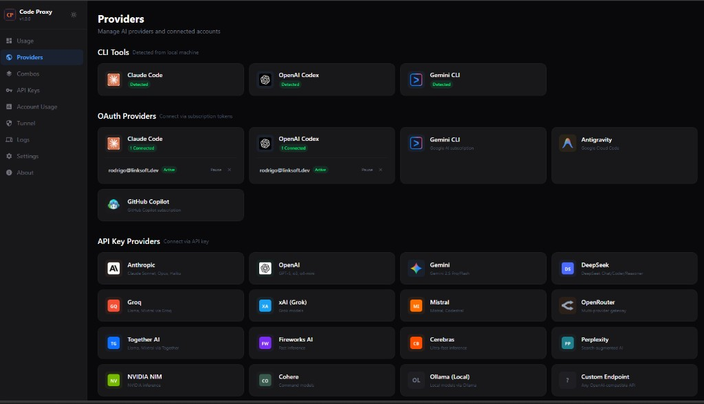
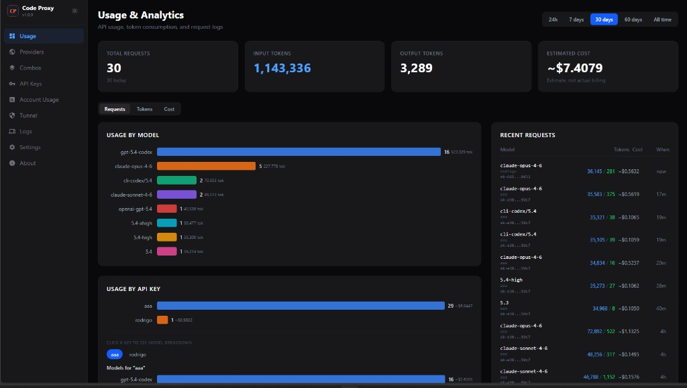

# Code Proxy

A unified proxy that lets you use **Claude Code**, **OpenAI Codex**, **Gemini** and other AI coding agents through any OpenAI-compatible client — like **Cursor**, VS Code, or any tool that speaks the OpenAI API.

## Why Code Proxy?

AI coding tools like **Cursor**, **Windsurf**, **Cline**, **Continue**, and others offer great agent capabilities — but using their built-in model credits can be expensive. Meanwhile, you're already paying for a Claude Max or Codex Pro subscription that includes powerful models.

**Code Proxy bridges this gap.** It lets any OpenAI-compatible client use your existing subscriptions — so you get the best of both worlds: **your favorite IDE's agent + your subscription's models**.

### Three modes, one endpoint

| Mode | What happens | Who is the agent? | Best for |
|------|-------------|-------------------|----------|
| **CLI Agent** | Spawns `claude` / `codex` binary | The CLI tool (reads files, runs commands) | Complex tasks — the AI *does* the work |
| **OAuth Provider** | Direct API call using your subscription token | **Your IDE** (reads files, runs commands, edits code) | Best of both worlds — your IDE's agent + subscription models |
| **API Key** | Direct API call using API key | Your IDE or chat-only | Quick questions, pay-per-token usage |

The **OAuth Provider** mode is the key differentiator. It works like [OpenCode](https://github.com/opencode-ai/opencode) or similar tools — but instead of a separate app, you use **your preferred IDE as the coding agent** (Cursor, Windsurf, Cline, Continue, or any OpenAI-compatible client), powered by models from your Claude Code, Codex, or Gemini subscription. No CLI binary needed, no extra token costs.

### Key benefits

- **Use your IDE with your subscription** — connect your Claude Max / Codex Pro / Gemini account via OAuth and let your IDE's agent (Cursor, Windsurf, Cline, etc.) use those models at no extra cost
- **Centralize subscriptions** — connect multiple accounts and share them across your team
- **Track usage** — see token counts, costs, and request history per model, per account, per API key
- **Control access** — create API keys, set quotas, revoke access instantly
- **One endpoint, all providers** — Claude, GPT, Gemini, DeepSeek, Groq, Together, Ollama — all through `http://localhost:3456/v1`

## How it works

```
Cursor / VS Code / any client
        │
        ▼
   Code Proxy (:3456)
   ┌─────────────────────────┐
   │  OpenAI-compatible API  │
   │  /v1/chat/completions   │
   │  /v1/models             │
   └────────┬────────────────┘
            │ routes by model prefix
            │
            │  CLI Agent (spawns local binary)
            ├── cli-cc/*    → Claude Code CLI (subscription)
            ├── cli-codex/* → Codex CLI (subscription)
            ├── cli-gc/*    → Gemini CLI (subscription)
            │
            │  OAuth Provider (subscription → direct API)
            ├── cc/*        → Claude via OAuth (subscription)
            ├── openai/*    → OpenAI via OAuth (subscription)
            ├── gemini/*    → Gemini via OAuth (subscription)
            │
            │  API Key Provider (pay-per-token)
            ├── anthropic/* → Anthropic API
            ├── openai/*    → OpenAI API
            ├── gemini/*    → Gemini API
            ├── deepseek/*  → DeepSeek API
            ├── groq/*      → Groq API
            └── generic/*   → Any OpenAI-compatible endpoint
```

> **Note:** When the same prefix (e.g. `openai/`) has both OAuth and API key accounts, Code Proxy picks from the available accounts using round-robin.

### Understanding the three modes

#### 1. CLI Agent — the AI does the work

Model prefix: `cli-cc/`, `cli-codex/`, `cli-gc/`

Code Proxy spawns the actual `claude` or `codex` binary on your machine:

- Uses your **subscription** (Claude Max, Codex Pro, etc.) — not API tokens
- The AI runs as a **full code agent** — it reads your files, runs commands, searches your codebase
- Your IDE acts as the display, but the agent doing the work is Claude Code or Codex

#### 2. OAuth Provider — Cursor as the agent, your subscription's models

Model prefix: `cc/`, `openai/`, `gemini/` (with OAuth account connected)

Code Proxy calls the provider API using your **subscription's OAuth token**:

- Uses your **subscription** — same models, same quota, no extra cost
- **Your IDE is the coding agent** — it reads files, runs commands, edits code using its own agent loop
- No CLI binary needed — works on any machine with just Code Proxy
- Works with any OpenAI-compatible client: Cursor, Windsurf, Cline, Continue, etc.

This is similar to how Claude Code or Codex work natively, but **your IDE replaces the CLI** as the agent. You get your IDE's UI, inline diffs, multi-file editing, and native integration — all powered by your existing subscription.

#### 3. API Key — pay-per-token

Model prefix: `anthropic/`, `openai/`, `gemini/`, `deepseek/`, etc. (with API key configured)

Code Proxy sends requests directly to the provider's HTTP API:

- Uses **API keys** — standard pay-per-token pricing
- Works for all 15+ supported providers
- Lower latency for quick questions

## Installation

### From source

```bash
git clone https://github.com/rodrigorodriguescosta/code-proxy.git
cd code-proxy
go build -o code-proxy .
./code-proxy
```

### Using `go install`

```bash
go install github.com/rodrigorodriguescosta/code-proxy@latest
code-proxy
```

### Download binary

Grab the latest release for your platform from [Releases](https://github.com/rodrigorodriguescosta/code-proxy/releases).

```bash
# Linux/macOS
chmod +x code-proxy
./code-proxy

# Or move to your PATH
sudo mv code-proxy /usr/local/bin/
```

### Deploy on a VPS

Code Proxy is a single binary with an embedded SQLite database — no external dependencies.

```bash
# 1. Download
wget https://github.com/rodrigorodriguescosta/code-proxy/releases/latest/download/code-proxy-linux-amd64
chmod +x code-proxy-linux-amd64

# 2. Configure (optional)
export PORT=3456
export DATA_DIR=/var/lib/code-proxy
export PROXY_REQUIRE_API_KEY=true

# 3. Run
./code-proxy-linux-amd64
```

#### Systemd service (recommended for VPS)

```ini
# /etc/systemd/system/code-proxy.service
[Unit]
Description=Code Proxy
After=network.target

[Service]
Type=simple
User=code-proxy
ExecStart=/usr/local/bin/code-proxy
Environment=PORT=3456
Environment=DATA_DIR=/var/lib/code-proxy
Environment=PROXY_REQUIRE_API_KEY=true
Restart=always

[Install]
WantedBy=multi-user.target
```

```bash
sudo systemctl enable --now code-proxy
```

#### Expose via Cloudflare Tunnel

Code Proxy has built-in Cloudflare tunnel support — no need for nginx or port forwarding.

**Quick Tunnel** (random URL — changes on every restart):

1. Open the dashboard → Tunnel → Enable Tunnel
2. A random `*.trycloudflare.com` URL is generated
3. Use this URL in Cursor — but note it **changes on every restart**

**Named Tunnel** (fixed URL — recommended):

The Quick Tunnel URL changes every time the tunnel restarts, which means you have to update Cursor settings constantly. For a **permanent URL**, use a Cloudflare Named Tunnel:

1. Go to [Cloudflare Zero Trust](https://one.dash.cloudflare.com) → Networks → Tunnels
2. Create a tunnel — name it "code-proxy" or similar
3. Add a public hostname (e.g. `proxy.yourdomain.com`) pointing to `http://localhost:3456`
4. Copy the tunnel token (starts with `eyJ...`)
5. In the dashboard → Tunnel → Configure Token → paste the token
6. Enable the tunnel — your fixed URL is now active

This way Cursor always points to `https://proxy.yourdomain.com/v1` and it never changes.

## Quick start with Cursor

> **Important:** Cursor does **not** support `localhost` as the OpenAI Base URL. You must expose Code Proxy via a **public URL** — either a VPS with a public IP, a Cloudflare tunnel, or any reverse proxy/tunnel solution. See [Tunnel setup](#expose-via-cloudflare-tunnel) below.

1. Start Code Proxy:
   ```bash
   code-proxy
   ```
2. Open the dashboard at `http://localhost:3456` and connect your accounts (OAuth or API key)
3. Enable a tunnel (Dashboard → Tunnel) or deploy on a VPS to get a public URL
4. In Cursor → Settings → Models → OpenAI API Key: enter any value (or a Code Proxy API key if you enabled `require_api_key`)
5. Set the Base URL to `https://your-public-url/v1`
6. Pick a model — use the prefix to choose the provider:

| Model ID | Mode | What happens |
|----------|------|--------------|
| `cli-cc/claude-sonnet-4-6` | CLI Agent | Spawns `claude` binary (subscription) |
| `cli-cc/claude-opus-4-6:max` | CLI Agent | Spawns `claude` binary (max effort) |
| `cli-codex/o3-pro` | CLI Agent | Spawns `codex` binary (subscription) |
| `cc/claude-sonnet-4-6` | OAuth | IDE as agent, Claude subscription |
| `cc/claude-opus-4-6` | OAuth | IDE as agent, Claude subscription |
| `openai/gpt-4o` | OAuth / API Key | IDE as agent, OpenAI subscription or API key |
| `gemini/gemini-2.5-pro` | OAuth / API Key | IDE as agent, Gemini subscription or API key |
| `anthropic/claude-sonnet-4-6` | API Key | Pay-per-token |
| `deepseek/deepseek-chat` | API Key | Pay-per-token |

### Effort levels

Append `:low`, `:medium`, `:high`, or `:max` to CLI models to control token usage:

```
cli-cc/claude-sonnet-4-6:low    → fast, minimal tokens
cli-cc/claude-sonnet-4-6:max    → thorough, more tokens
```

### CLI Agent limitations

The CLI Agent mode communicates with the `claude`/`codex` binary via a text-based protocol. Some IDE features are **not supported** in this mode:

- **Inline diffs** — the CLI protocol doesn't support structured diff output, so the IDE can't show inline change previews
- **Multi-file edit previews** — edits happen inside the CLI agent, not through the IDE's UI
- **Tool approval** — tool calls are managed by the CLI, not by the IDE

For the best experience, prefer the **OAuth Provider** mode — your IDE handles everything natively with full integration (diffs, multi-file edits, tool approval, etc.).

## Dashboard

The web dashboard at `http://localhost:3456` gives you full visibility and control over your proxy.

### Providers

Connect your accounts — detect local CLI tools, authenticate via OAuth, or add API keys. All 15+ providers are shown in one place.



### Usage & Analytics

Track requests, input/output token consumption, and estimated cost — broken down by model, by API key, and over configurable time windows (24h, 7d, 30d, 60d, all time). Click any API key to drill into its per-model breakdown.



### All dashboard features

| Feature | Description |
|---------|-------------|
| **Providers** | Connect accounts via OAuth or API key; detect local CLI tools |
| **Combos** | Define named model groups with sequential fallback (try model A → B → C) |
| **Usage & Analytics** | Requests, tokens, and estimated costs by model and API key |
| **Account Usage** | Per-account consumption breakdown across all providers |
| **Logs** | Full request history with model, tokens, cost, and duration |
| **API Keys** | Create, toggle, and revoke access keys; set usage quotas |
| **Tunnel** | Enable Cloudflare tunnel (quick or named) directly from the UI |
| **Settings** | Default model, dashboard password, require API key toggle |
| **Export / Import** | Export all configuration and accounts to JSON; restore on a new machine |

## Configuration

All settings are via environment variables:

| Variable | Default | Description |
|----------|---------|-------------|
| `PORT` | `3456` | HTTP port |
| `DATA_DIR` | `~/.code-proxy` | SQLite database location |
| `CLAUDE_MODEL` | `sonnet` | Default model when none specified |
| `WORK_DIR` | current dir | Working directory for CLI agents |
| `PROXY_API_KEY` | — | Comma-separated fallback API keys |
| `PROXY_REQUIRE_API_KEY` | `false` | Require API key for all requests |
| `USE_ACP` | `false` | Use ACP protocol instead of CLI exec |
| `ACP_COMMAND` | — | Path to ACP subprocess binary |

## Multi-account & rotation

Connect multiple accounts of the same provider. Code Proxy will:

- **Round-robin** across active accounts
- **Auto-cooldown** accounts that hit rate limits (exponential backoff)
- **Refresh OAuth tokens** automatically before they expire (checks every 5 minutes)
- **Skip inactive** or expired accounts

This lets you pool subscriptions across a team without sharing credentials.

## API

Code Proxy implements the OpenAI Chat Completions API:

```bash
# OAuth provider — Cursor as agent, using your subscription
curl http://localhost:3456/v1/chat/completions \
  -H "Content-Type: application/json" \
  -H "Authorization: Bearer your-api-key" \
  -d '{
    "model": "cc/claude-sonnet-4-6",
    "messages": [{"role": "user", "content": "Hello"}],
    "stream": true
  }'

# CLI agent — spawns the claude binary
curl http://localhost:3456/v1/chat/completions \
  -H "Content-Type: application/json" \
  -H "Authorization: Bearer your-api-key" \
  -d '{
    "model": "cli-cc/claude-sonnet-4-6",
    "messages": [{"role": "user", "content": "Refactor the auth module"}],
    "stream": true
  }'

# List models
curl http://localhost:3456/v1/models
```

## Security

- **Dashboard password** — optional password protection for the web UI
- **API key enforcement** — require Bearer token for all `/v1/*` requests
- **No credentials exposed** — API keys are stored hashed; OAuth tokens are encrypted at rest
- **CORS headers** — configurable for cross-origin access

## Prerequisites

For **CLI Agent** mode (`cli-cc/`, `cli-codex/`, `cli-gc/`), you need the CLI tool installed locally:

- **Claude Code**: `npm install -g @anthropic-ai/claude-code` and authenticate with `claude`
- **Codex**: `npm install -g @openai/codex` and authenticate with `codex`
- **Gemini CLI**: install and authenticate per Google's instructions

For **OAuth Provider** mode (`cc/`, `openai/`, `gemini/`), just connect your account via the dashboard — no CLI installation needed. Code Proxy handles OAuth token management and refresh automatically.

For **API Key** mode, you just need an API key from the provider.

## Author

Created by **Rodrigo Rodrigues** ([@rodrigorodriguescosta](https://github.com/rodrigorodriguescosta)).

## License

MIT
